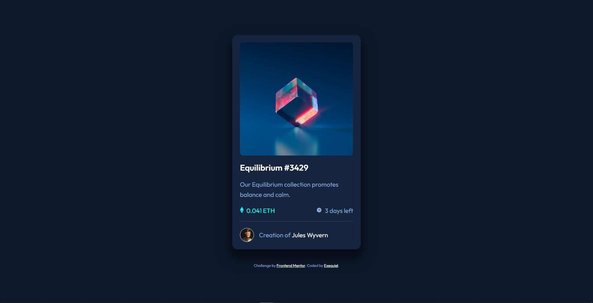
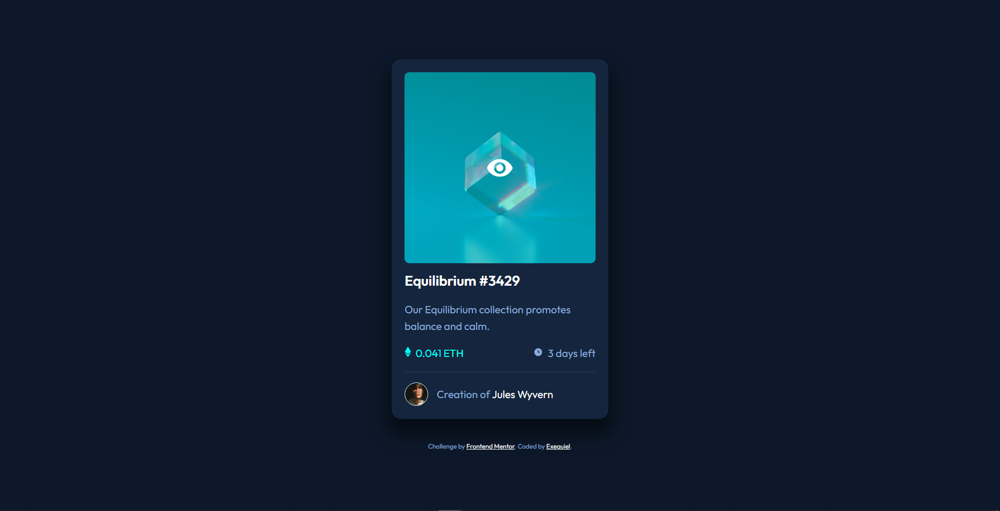

# Frontend Mentor - NFT preview card component solution

This is a solution to the [NFT preview card component challenge on Frontend Mentor](https://www.frontendmentor.io/challenges/nft-preview-card-component-SbdUL_w0U). Frontend Mentor challenges help you improve your coding skills by building realistic projects.

## Table of contents

- [Overview](#overview)
  - [The challenge](#the-challenge)
  - [Screenshot](#screenshot)
  - [Links](#links)
- [My process](#my-process)
  - [Built with](#built-with)
  - [What I learned](#what-i-learned)
- [Author](#author)

## Overview

### The challenge

Users should be able to:

- View the optimal layout depending on their device's screen size
- See hover states for interactive elements

### Screenshot




### Links

- Solution URL: [https://github.com/quielLovesLasagna/nft-preview-card-component](https://github.com/quielLovesLasagna/nft-preview-card-component)
- Live Site URL: [https://quiel-nft-preview-card-component.netlify.app/](https://quiel-nft-preview-card-component.netlify.app/)

## My process

### Built with

- Semantic HTML5 markup
- CSS3
- Flexbox

### What I learned

Adding overlay in hover state.

```html
<div class="img-container">
  
  <div class="overlay">
    
  </div>
  </div>
</div>
```

```css
.overlay {
  background-color: rgba(0, 255, 247, 0.5);
  position: absolute;
  top: 50%;
  left: 50%;
  transform: translate(-50%, -50%);
  width: 100%;
  height: 100%;
  display: flex;
  align-items: center;
  justify-content: center;
  border-radius: 0.8rem;
  opacity: 0;
  transition: all 0.5s;
}

.img-container:hover .overlay {
  opacity: 1;
}
```

## Author

- Website - [quileLovesLasagna]()
- Frontend Mentor - [@quileLovesLasagna](https://www.frontendmentor.io/profile/quielLovesLasagna)
